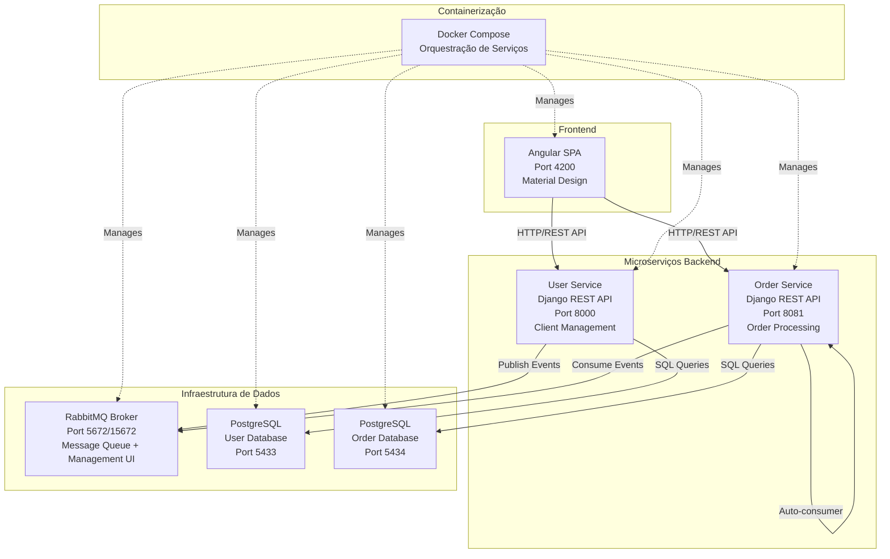
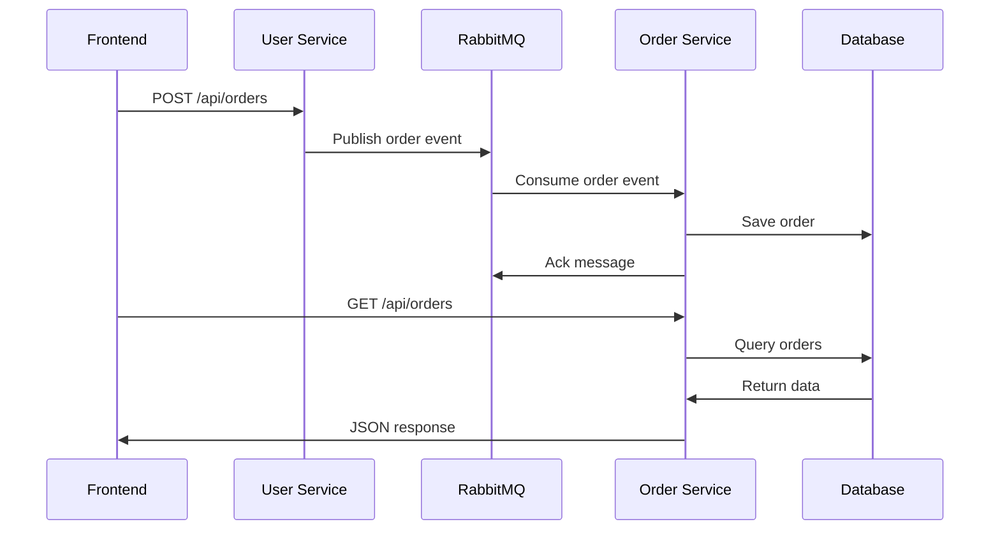

# Sistema de Gestão de Pedidos com Arquitetura de Microserviços

**Trabalho de Conclusão de Curso (TCC)**  
**MBA em Engenharia de Software - USP/ESALQ**  

[](https://docker.com)
[](https://djangoproject.com)
[](https://angular.io)
[](https://rabbitmq.com)
[](https://postgresql.org)

---

## 📋 Índice

- [Sobre o Projeto](#sobre-o-projeto)
- [Arquitetura](#arquitetura)
- [Tecnologias Utilizadas](#tecnologias-utilizadas)
- [Estrutura do Monorepo](#estrutura-do-monorepo)
- [Pré-requisitos](#pré-requisitos)
- [Instalação e Execução](#instalação-e-execução)
- [Recursos Implementados](#recursos-implementados)
- [Documentação da API](#documentação-da-api)
- [Fluxo de Dados](#fluxo-de-dados)
- [Decisões de Arquitetura](#decisões-de-arquitetura)
- [Considerações de Produção](#considerações-de-produção)
- [Troubleshooting](#troubleshooting)

---

## 🎯 Sobre o Projeto

Este projeto implementa um **sistema distribuído de gestão de pedidos** para restaurantes, utilizando princípios de **arquitetura de microserviços**, **mensageria assíncrona** e **containerização completa**. Desenvolvido como Trabalho de Conclusão de Curso do MBA em Engenharia de Software da USP/ESALQ.

### 🎯 Objetivos Acadêmicos

- **Demonstrar** aplicação prática de padrões arquiteturais modernos
- **Implementar** comunicação assíncrona entre serviços usando RabbitMQ  
- **Aplicar** princípios de separação de responsabilidades (SoC)
- **Utilizar** containerização Docker para ambientes reproduzíveis
- **Desenvolver** aplicação full-stack escalável e maintível
- **Explorar** conceitos de Event-Driven Architecture

### 🏪 Cenário de Negócio

O sistema simula um **restaurante digital** completo onde:
- ✅ **Clientes** são gerenciados por serviço dedicado com autocomplete inteligente
- ✅ **Pedidos** são processados assincronamente via filas RabbitMQ  
- ✅ **Cardápio** (order items) possui CRUD completo e busca otimizada
- ✅ **Interface web** responsiva com Angular Material Design
- ✅ **Arquitetura** suporta alta disponibilidade e escalabilidade horizontal
- ✅ **Integração** completa entre microserviços via messaging

### 🚀 Funcionalidades Principais

- **Gestão de Clientes**: Cadastro, edição, exclusão e busca inteligente
- **Gestão de Cardápio**: CRUD completo de itens do menu
- **Sistema de Pedidos**: Criação de pedidos com autocomplete de clientes e itens
- **Messaging Assíncrono**: Processamento de pedidos via RabbitMQ
- **Interface Responsiva**: Angular com Material Design e feedback visual
- **Containerização**: Deploy completo com Docker Compose
- **Banco Segregado**: Bancos PostgreSQL isolados por contexto

---

## 🏗️ Arquitetura

### Visão Geral da Arquitetura



### Componentes Arquiteturais

#### 🎨 Frontend Layer
- **Angular 19.2** com Server-Side Rendering (SSR)
- **Material Design** para UX consistente
- **Reactive Forms** para validação robusta
- **RxJS Observables** para programação reativa
- **Autocomplete** inteligente para busca de dados

#### 🛠️ Backend Layer  
- **User Service**: Microserviço especializado em gestão de clientes
- **Order Service**: Microserviço para pedidos + consumidor RabbitMQ automático
- **Django REST Framework** para APIs padronizadas
- **CORS configurado** para integração frontend-backend

#### 💾 Data Layer
- **PostgreSQL 15**: Bancos isolados por contexto (user_db + order_db)
- **Migrations automáticas** via script start_services.py
- **Connection pooling** e configurações otimizadas

#### 📨 Message Layer
- **RabbitMQ** com Management UI para monitoramento
- **Consumer automático** integrado no Order Service
- **Event-driven** communication entre serviços
- **Durabilidade** de filas para garantia de entrega

### Padrões Arquiteturais Implementados

- **🏛️ Microservices Architecture**: Serviços independentes e especializados
- **📨 Event-Driven Architecture**: Comunicação assíncrona via eventos
- **� Repository Pattern**: Abstração da camada de dados via ViewSets
- **🎯 Single Responsibility**: Cada serviço tem responsabilidade única
- **🔌 API-First Design**: APIs RESTful bem definidas e documentadas
- **🐳 Container-First**: Infraestrutura completamente containerizada
- **⚡ Reactive Programming**: Interfaces reativas com RxJS

---

## 🛠️ Tecnologias Utilizadas

### Backend & APIs
- **Django 5.2.3** - Framework web Python robusto
- **Django REST Framework 3.16.0** - Toolkit para APIs REST  
- **psycopg2-binary 2.9.10** - Driver PostgreSQL otimizado
- **pika 1.3.2** - Cliente RabbitMQ para Python
- **python-dotenv 1.1.1** - Gerenciamento de variáveis ambiente
- **django-cors-headers 4.7.0** - Configuração CORS para SPAs

### Frontend & UX
- **Angular 19.2** - Framework SPA com SSR
- **Angular Material 19.2.19** - Design System Material Design
- **Angular CDK 19.2.19** - Component Development Kit  
- **RxJS 7.8** - Programação reativa e Observables
- **TypeScript 5.6** - Tipagem estática para JavaScript
- **ngx-toastr 19.0.0** - Notificações toast customizadas
- **Angular SSR** - Server-Side Rendering para SEO e performance

### Infraestrutura & DevOps
- **Docker & Docker Compose** - Containerização e orquestração
- **PostgreSQL 15** - Banco relacional com alta performance
- **RabbitMQ 3-management** - Message broker com UI administrativa
- **Node.js 18-alpine** - Runtime JavaScript otimizado
- **Python 3.10-slim** - Runtime Python para microserviços

### Ferramentas de Desenvolvimento
- **ESLint** - Análise estática de código TypeScript/JavaScript
- **Prettier** - Formatação automática de código  
- **Git** - Controle de versão distribuído
- **VS Code** - IDE com suporte completo ao projeto
- **Bruno** - Cliente API para testes (alternativa ao Postman)

### Arquitetura de Deployment
- **Multi-stage Docker builds** - Builds otimizados
- **Docker networking** - Comunicação entre containers
- **Volume persistence** - Dados PostgreSQL persistentes
- **Environment variables** - Configuração flexível por ambiente
- **Health checks** - Monitoramento de saúde dos serviços

---

## 📁 Estrutura do Monorepo

```
mba-tcc-project/
├── 📁 user_service/                 # Microserviço de Usuários/Clientes
│   ├── 📁 users/                    # Django App
│   │   ├── 📄 models.py             # Modelo Client com validações
│   │   ├── 📄 viewsets.py           # CRUD + Autocomplete ViewSets
│   │   ├── 📄 serializer.py         # Serializers DRF otimizados
│   │   ├── 📄 urls.py               # Rotas da API
│   │   └── 📁 behaviors/            # Regras de negócio
│   │       └── user_autocomplete_behavior.py  # Lógica de busca
│   ├── 📁 user_service/             # Configurações Django
│   │   ├── 📄 settings.py           # Config banco, CORS, etc
│   │   └── 📄 urls.py               # URLs principais
│   └── 📄 .env                      # Variáveis de ambiente
│
├── 📁 order_service/                # Microserviço de Pedidos
│   ├── 📁 order/                    # Django App
│   │   ├── 📄 models.py             # Models Order + OrderItem
│   │   ├── 📄 viewsets.py           # CRUD completo
│   │   ├── 📄 consumer.py           # RabbitMQ Consumer
│   │   ├── 📁 behaviors/            # Regras de negócio
│   │   │   └── order_item_autocomplete_behavior.py
│   │   └── 📁 management/commands/  # Comandos Django customizados
│   │       └── consume_orders.py    # Comando para consumir filas
│   ├── 📁 order_service/            # Configurações Django  
│   ├── 📄 start_services.py         # Script de inicialização avançado
│   └── 📄 .env                      # Variáveis de ambiente
│
├── 📁 order_system/                 # Frontend Angular com SSR
│   ├── 📁 src/app/                  # Código fonte principal
│   │   ├── 📁 page/                 # Componentes de página
│   │   │   ├── 📁 client/           # Gestão de clientes
│   │   │   │   ├── client.component.ts/html/scss
│   │   │   ├── 📁 food/             # Gestão de cardápio
│   │   │   │   ├── food.component.ts/html/scss  
│   │   │   ├── 📁 order/            # Gestão de pedidos
│   │   │   │   ├── order.component.ts/html/scss
│   │   │   └── 📁 intro/            # Página inicial
│   │   ├── 📁 service/              # Serviços HTTP
│   │   │   ├── client.service.ts    # API calls para clientes
│   │   │   └── order-item.service.ts # API calls para items
│   │   ├── 📁 core/                 # Serviços base
│   │   │   └── user-base.service.ts # BaseService com SSR
│   │   ├── 📁 shared/               # Componentes reutilizáveis
│   │   │   ├── 📁 client-dialog/    # Modal de cliente
│   │   │   └── 📁 order-item-dialog/ # Modal de item
│   │   └── 📁 models/               # Interfaces TypeScript
│   │       ├── client.model.ts      # Interface ClientModel
│   │       └── order_item.model.ts  # Interface OrderItemModel
│   ├── 📄 package.json              # Dependências Node.js
│   ├── 📄 angular.json              # Configuração Angular
│   ├── 📄 Dockerfile                # Container Angular
│   └── 📄 .eslintrc.json            # Config ESLint
│
├── 📁 MBA PROJECT/                  # Coleção de APIs Bruno
│   ├── 📄 bruno.json                # Configuração Bruno
│   ├── 📄 GET CLIENT.bru            # Teste GET clientes  
│   ├── 📄 POST CLIENT.bru           # Teste POST cliente
│   ├── 📄 POST AUTOCOMPLETE CLIENT.bru # Teste autocomplete
│   ├── 📄 GET ORDER ITEM.bru        # Teste GET itens
│   └── 📄 POST ORDER ITEM copy.bru  # Teste POST item
│
├── 📄 docker-compose.yml            # Orquestração completa
├── 📄 Dockerfile.user_service       # Container user service  
├── 📄 Dockerfile.order_service      # Container order service
├── � requirements.txt              # Dependências Python
├── 📄 rabbitmq.conf                 # Configuração RabbitMQ
└── 📄 README.md                     # Esta documentação
```

### 🎯 Destaques da Estrutura

- **Separação clara** entre frontend e backends
- **Microserviços independentes** com bancos segregados  
- **Scripts automatizados** para inicialização (start_services.py)
- **Testes de API** organizados com Bruno
- **Configurações Docker** otimizadas para desenvolvimento
- **SSR Angular** para performance e SEO
- **Padrão de pastas** escalável e maintível

---

## ✅ Pré-requisitos

### Software Necessário
- **Docker Desktop** 4.0+ (Windows/Mac) ou **Docker Engine** 20.0+ (Linux)
- **Docker Compose** 2.0+
- **Git** 2.30+ para clonagem do repositório

### Recursos de Sistema Recomendados
- **RAM**: 6GB disponível (4GB mínimo)
- **Armazenamento**: 3GB livre para imagens Docker
- **CPU**: 2 cores (4 cores recomendado)

### Portas que Precisam Estar Livres
- **4200**: Angular frontend  
- **8000**: User service API
- **8081**: Order service API  
- **5433**: PostgreSQL user database
- **5434**: PostgreSQL order database
- **5672**: RabbitMQ AMQP
- **15672**: RabbitMQ Management UI

### Verificação de Ambiente
```bash
# Verificar Docker
docker --version
docker-compose --version

# Verificar portas livres (Windows)
netstat -an | findstr ":4200 :8000 :8081 :5433 :5434 :5672 :15672"

# Verificar portas livres (Linux/Mac)  
netstat -an | grep -E ":4200|:8000|:8081|:5433|:5434|:5672|:15672"
```

---

## 🚀 Instalação e Execução

### 1️⃣ Clone do Repositório
```bash
git clone https://github.com/gilcllys/mba-tcc-project.git
cd mba-tcc-project
```

### 2️⃣ Verificação das Configurações
As variáveis de ambiente já estão pré-configuradas:

**user_service/.env**
```env
DB_HOST=user_db
DB_NAME=user_database
DB_USER=postgres
DB_PASSWORD=123456
RABBITMQ_HOST=rabbitmq
RABBITMQ_PORT=5672
RABBITMQ_USER=guest
RABBITMQ_PASSWORD=guest
```

**order_service/.env**  
```env
DB_HOST=order_db
DB_NAME=order_database
DB_USER=postgres
DB_PASSWORD=123456
RABBITMQ_HOST=rabbitmq
RABBITMQ_PORT=5672
RABBITMQ_USER=guest
RABBITMQ_PASSWORD=guest
```

### 3️⃣ Execução com Docker Compose (Recomendado)
```bash
# 🚀 Construir e executar todos os serviços
docker-compose up --build -d

# ✅ Verificar status dos containers
docker-compose ps

# 📊 Acompanhar logs de todos os serviços
docker-compose logs -f

# 📋 Ver logs de um serviço específico  
docker-compose logs -f order_system  # Angular
docker-compose logs -f user_service  # User API
docker-compose logs -f order_service # Order API
```

### 4️⃣ Acesso aos Serviços

| Serviço | URL | Descrição | Status |
|---------|-----|-----------|---------|
| 🌐 **Frontend Angular** | http://localhost:4200 | Interface principal do usuário | ✅ SSR Habilitado |
| � **User Service API** | http://localhost:8000 | API de clientes + autocomplete | ✅ CORS Configurado |
| 📦 **Order Service API** | http://localhost:8081 | API de pedidos + itens | ✅ Consumer Automático |
| 🐰 **RabbitMQ Management** | http://localhost:15672 | Interface administrativa | 📊 guest/guest |
| 🗄️ **PostgreSQL User DB** | localhost:5433 | Banco de clientes | 💾 user_database |
| 🗄️ **PostgreSQL Order DB** | localhost:5434 | Banco de pedidos | 💾 order_database |

### 5️⃣ Verificação da Instalação

#### Teste Manual das APIs
```bash
# 👥 Testar User Service - Listar clientes
curl http://localhost:8000/users/client/

# 📦 Testar Order Service - Listar itens do menu  
curl http://localhost:8081/order/order_item/

# 🔍 Testar Order Service - Listar pedidos
curl http://localhost:8081/order/order_client/
```

#### Teste via Bruno (Cliente API)
1. Instalar Bruno: https://usebruno.com/
2. Abrir coleção em `MBA PROJECT/bruno.json`  
3. Executar requests de teste pré-configurados

#### Verificação de Logs
```bash
# 🔍 Verificar se migrações foram aplicadas
docker-compose logs order_service | grep -i migration

# 📨 Verificar se RabbitMQ consumer está ativo
docker-compose logs order_service | grep -i consumer

# 🔄 Verificar compilação do Angular
docker-compose logs order_system | grep -i "compilation complete"
```

### 6️⃣ Comandos Úteis para Desenvolvimento

```bash
# 🛑 Parar todos os serviços
docker-compose down

# 🔄 Rebuild de serviço específico
docker-compose up --build -d user_service
docker-compose up --build -d order_service  
docker-compose up --build -d order_system

# 🧹 Limpeza completa (remove volumes)
docker-compose down -v
docker system prune -a

# 🐚 Executar comandos dentro dos containers
docker-compose exec user_service python manage.py shell
docker-compose exec order_service python manage.py migrate
docker-compose exec order_system npm run build

# 📊 Monitoramento de recursos
docker stats
```

### 7️⃣ Troubleshooting Inicial

| Problema | Solução |
|----------|---------|
| ❌ Porta em uso | Verificar se outras aplicações usam as portas 4200, 8000, 8081 |
| ❌ Container não inicia | `docker-compose logs [service-name]` para ver erros |
| ❌ Angular não carrega | Aguardar compilação completa (~30-60s na primeira execução) |
| ❌ APIs não respondem | Verificar se bancos PostgreSQL subiram corretamente |
| ❌ RabbitMQ error | Aguardar ~10s para inicialização completa do message broker |

### 🎯 Primeiro Acesso Recomendado

1. ✅ Acessar http://localhost:4200 (Angular)
2. ✅ Ir para "Clientes" e cadastrar um cliente teste
3. ✅ Ir para "Cardápio" e cadastrar itens de menu  
4. ✅ Ir para "Pedidos" e testar autocomplete
5. ✅ Verificar RabbitMQ UI em http://localhost:15672

## 🎨 Recursos Implementados

### 👥 Gestão de Clientes (User Service)
- ✅ **CRUD Completo**: Create, Read, Update, Delete de clientes
- ✅ **Autocomplete Inteligente**: Busca por nome, email ou telefone  
- ✅ **Validações**: Email único, telefone formatado, campos obrigatórios
- ✅ **API RESTful**: Endpoints padronizados com Django REST Framework
- ✅ **Paginação**: Suporte a large datasets via pagination
- ✅ **Filtros**: Busca avançada por múltiplos campos

### 🍽️ Gestão de Cardápio (Order Service)
- ✅ **CRUD de Itens**: Gerenciamento completo do menu do restaurante
- ✅ **Preços Decimais**: Suporte a valores monetários precisos
- ✅ **Categorização**: Organização por tipos de prato
- ✅ **Busca Otimizada**: Autocomplete por nome de item
- ✅ **Validações**: Preços positivos, nomes únicos por categoria

### 📋 Sistema de Pedidos
- ✅ **Criação de Pedidos**: Interface intuitiva com dropdowns
- ✅ **Autocomplete Duplo**: Cliente + Item do menu simultâneo
- ✅ **Quantidades**: Controle preciso de itens por pedido
- ✅ **Cálculo Automático**: Total do pedido calculado em tempo real
- ✅ **Histórico**: Listagem de todos os pedidos com filtros
- ✅ **Status Tracking**: Acompanhamento do status do pedido

### 🔄 Processamento Assíncrono
- ✅ **RabbitMQ Integration**: Message broker para comunicação
- ✅ **Auto-Consumer**: Consumidor automático integrado no Order Service  
- ✅ **Event Publishing**: User Service publica eventos de pedidos
- ✅ **Event Processing**: Order Service processa pedidos de forma assíncrona
- ✅ **Error Handling**: Tratamento robusto de falhas de messaging
- ✅ **Queue Durability**: Filas persistentes para garantia de entrega

### 🎨 Interface do Usuário (Angular)
- ✅ **Material Design**: Componentes Google Material Design
- ✅ **Responsive**: Adapta a mobile, tablet e desktop
- ✅ **SSR (Server-Side Rendering)**: Performance e SEO otimizados
- ✅ **Reactive Forms**: Validação reativa com feedback visual
- ✅ **Toast Notifications**: Feedback imediato para ações do usuário
- ✅ **Loading States**: Indicadores visuais durante requisições
- ✅ **Error Handling**: Tratamento elegante de erros de API

### 🔧 Funcionalidades Técnicas
- ✅ **Docker Compose**: Orquestração completa de containers
- ✅ **Database Migrations**: Migrações automáticas do Django
- ✅ **CORS Configuration**: Integração segura frontend-backend
- ✅ **Environment Variables**: Configuração flexível por ambiente  
- ✅ **Health Checks**: Monitoramento da saúde dos serviços
- ✅ **Logging**: Sistema de logs estruturado para debugging
- ✅ **API Documentation**: Endpoints bem documentados

### 🚀 Recursos Avançados
- ✅ **Navigation Refresh**: Recarregamento automático de dados entre páginas
- ✅ **Window Focus Refresh**: Atualização quando usuário volta à aba
- ✅ **Manual Refresh**: Botão de refresh manual para dados
- ✅ **Observable Patterns**: RxJS para programação reativa
- ✅ **Service Isolation**: Bancos de dados separados por contexto
- ✅ **Concurrent Processing**: Threading para consumer RabbitMQ
- ✅ **Graceful Shutdown**: Encerramento limpo de processos

---

## 📚 Documentação da API

### 👥 User Service Endpoints (Port 8000)

#### Gestão de Clientes
```http
GET    /users/client/                    # Listar todos os clientes
POST   /users/client/                    # Criar novo cliente  
GET    /users/client/{id}/               # Obter cliente específico
PUT    /users/client/{id}/               # Atualizar cliente completo
PATCH  /users/client/{id}/               # Atualização parcial
DELETE /users/client/{id}/               # Deletar cliente
```

#### Funcionalidades Avançadas  
```http
POST   /users/client/auto_complete_users/   # Autocomplete inteligente
GET    /users/client/?search=nome           # Busca por texto
GET    /users/client/?page=2                # Paginação
```

### 📦 Order Service Endpoints (Port 8081)

#### Gestão de Pedidos
```http
GET    /order/order_client/             # Listar pedidos
POST   /order/order_client/             # Criar pedido
GET    /order/order_client/{id}/        # Obter pedido específico  
PUT    /order/order_client/{id}/        # Atualizar pedido
DELETE /order/order_client/{id}/        # Deletar pedido
```

#### Gestão de Itens do Menu
```http
GET    /order/order_item/               # Listar itens do cardápio
POST   /order/order_item/               # Criar item do menu
GET    /order/order_item/{id}/          # Obter item específico
PUT    /order/order_item/{id}/          # Atualizar item
DELETE /order/order_item/{id}/          # Deletar item
```

#### Funcionalidades Avançadas
```http
POST   /order/order_item/auto_complete_order_item/  # Autocomplete de itens
GET    /order/order_item/?search=pizza              # Busca por nome
GET    /order/order_client/?client_id=123           # Pedidos por cliente
```

### 📋 Exemplos de Requests/Responses

#### Criar Cliente
**POST /users/client/**
```json
{
  "name": "João Silva",
  "email": "joao@exemplo.com", 
  "phone": "+5511999887766"
}
```

**Response 201 Created:**
```json
{
  "id": 1,
  "name": "João Silva",
  "email": "joao@exemplo.com",
  "phone": "+5511999887766",
  "created_at": "2025-09-28T22:30:00.123Z",
  "updated_at": "2025-09-28T22:30:00.123Z"
}
```

#### Criar Item do Menu  
**POST /order/order_item/**
```json
{
  "item_name": "Pizza Margherita",
  "price": "25.90",
  "category": "Pizza",
  "description": "Pizza tradicional com tomate, mozzarella e manjericão"
}
```

**Response 201 Created:**
```json
{
  "id": 1,
  "item_name": "Pizza Margherita", 
  "price": "25.90",
  "category": "Pizza",
  "description": "Pizza tradicional com tomate, mozzarella e manjericão",
  "created_at": "2025-09-28T22:35:00.456Z"
}
```

#### Criar Pedido (Processado Assíncronamente)
**POST /order/order_client/**
```json
{
  "client_id": 1,
  "order_item_id": 1, 
  "quantity": 2,
  "notes": "Sem cebola, por favor"
}
```

**Response 201 Created:**
```json
{
  "id": 1,
  "client_id": 1,
  "order_item_id": 1,
  "quantity": 2,
  "total_price": "51.80",
  "status": "pending",
  "notes": "Sem cebola, por favor",
  "created_at": "2025-09-28T22:40:00.789Z"
}
```

#### Autocomplete de Clientes
**POST /users/client/auto_complete_users/**
```json
{
  "query": "joão"
}
```

**Response 200 OK:**
```json
[
  {
    "id": 1,
    "name": "João Silva",
    "email": "joao@exemplo.com",
    "phone": "+5511999887766"
  },
  {
    "id": 15,
    "name": "João Pedro Santos", 
    "email": "joaopedro@teste.com",
    "phone": "+5511888776655"
  }
]
```

### 🔒 Headers Necessários

```http
Content-Type: application/json
Accept: application/json
# CORS habilitado para localhost:4200
```

### ❌ Códigos de Erro Padronizados

| Status Code | Significado | Exemplo |
|-------------|-------------|---------|  
| `200` | ✅ Sucesso | Operação realizada |
| `201` | ✅ Criado | Recurso criado com sucesso |
| `400` | ❌ Bad Request | Dados inválidos enviados |
| `404` | ❌ Not Found | Recurso não encontrado |
| `500` | ❌ Server Error | Erro interno do servidor |

**Exemplo de Erro 400:**
```json
{
  "error": "Bad Request",
  "message": "Email já cadastrado no sistema",
  "field": "email",
  "code": "unique_constraint_violation"
}
```

---

## 🛠️ Troubleshooting

### 🚨 Problemas Comuns e Soluções

#### ❌ Container não inicia / Erro de porta
```bash
# Verificar portas em uso
netstat -an | findstr ":4200 :8000 :8081"  # Windows
lsof -i :4200,8000,8081                     # Linux/Mac

# Parar processos que usam as portas
docker-compose down
# Aguardar e tentar novamente
docker-compose up -d
```

#### ❌ Angular não carrega (localhost:4200)
```bash
# Verificar logs de compilação
docker-compose logs -f order_system

# Aguardar compilação completa (pode demorar 30-60s)
# Procurar por "Application bundle generation complete"

# Se persistir, rebuild:
docker-compose up --build -d order_system
```

#### ❌ APIs não respondem (8000/8081)
```bash
# Verificar se bancos PostgreSQL subiram
docker-compose logs user_db order_db

# Verificar se migrações foram aplicadas
docker-compose logs user_service | grep migration
docker-compose logs order_service | grep migration

# Forçar migrações manualmente
docker-compose exec user_service python manage.py migrate
docker-compose exec order_service python manage.py migrate
```

#### ❌ RabbitMQ connection error
```bash
# Verificar status do RabbitMQ
docker-compose logs rabbitmq

# Aguardar inicialização completa (~15s)
# Verificar UI em http://localhost:15672 (guest/guest)

# Se necessário, reiniciar apenas RabbitMQ:
docker-compose restart rabbitmq
```

#### ❌ Dropdowns vazios no Angular
```bash
# Verificar se APIs retornam dados
curl http://localhost:8000/users/client/
curl http://localhost:8081/order/order_item/

# Verificar logs do Angular para erros CORS
docker-compose logs order_system | grep -i cors

# Verificar network entre containers  
docker-compose exec order_system ping user_service
```

#### ❌ Dados não persistem após restart
```bash
# Verificar volumes Docker
docker volume ls | grep mba-tcc

# Se perdeu dados, verificar se volumes existem:
docker-compose down
docker-compose up -d
```

### 🔍 Comandos de Debug Úteis

#### Verificação de Status Geral
```bash
# Status de todos os containers
docker-compose ps

# Uso de recursos
docker stats

# Verificar rede Docker
docker network ls
docker-compose exec user_service nslookup order_service
```

#### Logs Específicos  
```bash
# Logs com timestamps
docker-compose logs -t user_service

# Logs em tempo real de múltiplos serviços
docker-compose logs -f user_service order_service

# Filtrar logs por palavra-chave
docker-compose logs user_service | grep ERROR
docker-compose logs order_system | grep -i compile
```

#### Testes Manuais de API
```bash
# Testar conectividade básica
curl -I http://localhost:4200  # Angular
curl -I http://localhost:8000  # User Service  
curl -I http://localhost:8081  # Order Service

# Testar CORS
curl -H "Origin: http://localhost:4200" \
     -H "Access-Control-Request-Method: GET" \
     -X OPTIONS http://localhost:8000/users/client/

# Testar endpoints com dados
curl -X POST http://localhost:8000/users/client/ \
     -H "Content-Type: application/json" \
     -d '{"name":"Test","email":"test@test.com","phone":"123"}'
```

#### Acesso aos Containers
```bash
# Shell nos containers para debug
docker-compose exec user_service bash
docker-compose exec order_service bash  
docker-compose exec order_system sh

# Executar comandos Django diretamente
docker-compose exec user_service python manage.py shell
docker-compose exec order_service python manage.py dbshell
```

### 🏥 Health Checks

#### Verificação Automática de Saúde
```bash
# Script para verificar todos os serviços
#!/bin/bash
echo "🔍 Verificando saúde dos serviços..."

# Angular
if curl -s http://localhost:4200 > /dev/null; then
    echo "✅ Angular (4200) - OK"
else  
    echo "❌ Angular (4200) - FALHOU"
fi

# User Service
if curl -s http://localhost:8000/users/client/ > /dev/null; then
    echo "✅ User Service (8000) - OK"
else
    echo "❌ User Service (8000) - FALHOU"  
fi

# Order Service
if curl -s http://localhost:8081/order/order_item/ > /dev/null; then
    echo "✅ Order Service (8081) - OK"
else
    echo "❌ Order Service (8081) - FALHOU"
fi

# RabbitMQ  
if curl -s http://localhost:15672 > /dev/null; then
    echo "✅ RabbitMQ (15672) - OK"
else
    echo "❌ RabbitMQ (15672) - FALHOU"
fi
```

### 🆘 Reset Completo (Último Recurso)
```bash
# ⚠️  ATENÇÃO: Remove todos os dados!
docker-compose down -v        # Para containers e remove volumes
docker system prune -a        # Limpa imagens não utilizadas  
docker volume prune          # Remove volumes não utilizados

# Reconstruir do zero
docker-compose up --build -d

# Aguardar inicialização completa (2-3 minutos)
```

---

## 🔄 Fluxo de Dados

### 1. Cadastro de Cliente
```
Frontend Angular → User Service API → PostgreSQL (user_db)
```

### 2. Criação de Pedido (Assíncrono)
```
Frontend Angular → User Service API → RabbitMQ Queue → Order Service Consumer → PostgreSQL (order_db)
```

### 3. Consulta de Pedidos
```
Frontend Angular → Order Service API → PostgreSQL (order_db)
```

### Diagrama de Sequência



---

## 🎨 Decisões de Arquitetura

### 1. **Escolha por Microserviços**
- **Vantagem**: Escalabilidade independente, tecnologias específicas
- **Trade-off**: Complexidade de coordenação, consistência eventual

### 2. **Mensageria Assíncrona (RabbitMQ)**
- **Vantagem**: Desacoplamento, resiliência, processamento assíncrono
- **Trade-off**: Complexidade adicional, necessidade de monitoramento

### 3. **Bancos de Dados Separados**
- **Vantagem**: Isolamento de dados, otimização específica
- **Trade-off**: Transações distribuídas, maior complexidade

### 4. **Containerização Completa**
- **Vantagem**: Portabilidade, consistência entre ambientes
- **Trade-off**: Overhead de recursos, curva de aprendizado

### 5. **API-First Design**
- **Vantagem**: Flexibilidade de frontend, testabilidade
- **Trade-off**: Latência de rede, versioning de API

---

## 🏭 Considerações de Produção

### Segurança
- [ ] **Autenticação JWT** nos microserviços
- [ ] **Rate limiting** nas APIs
- [ ] **Validação rigorosa** de entrada
- [ ] **HTTPS** em todas as comunicações
- [ ] **Secrets management** (HashiCorp Vault, AWS Secrets Manager)

### Observabilidade
- [ ] **Logging estruturado** (ELK Stack)
- [ ] **Métricas de aplicação** (Prometheus + Grafana)
- [ ] **Tracing distribuído** (Jaeger, Zipkin)
- [ ] **Health checks** e **readiness probes**

### Escalabilidade
- [ ] **Kubernetes** para orquestração
- [ ] **Load balancing** (Nginx, HAProxy)
- [ ] **Auto-scaling** baseado em métricas
- [ ] **Circuit breakers** (resilience4j)

### CI/CD
- [ ] **Pipeline automatizado** (GitHub Actions, Jenkins)
- [ ] **Testes automatizados** (unitários, integração, e2e)
- [ ] **Deploy blue-green** ou **canary**
- [ ] **Rollback automatizado**

---

## 🤝 Como Contribuir

Este projeto foi desenvolvido para fins acadêmicos como TCC do MBA USP/ESALQ, mas contribuições da comunidade são muito bem-vindas!

### 🚀 Como Contribuir

1. **Fork** o repositório
2. **Clone** seu fork: `git clone https://github.com/SEU-USUARIO/mba-tcc-project.git`
3. **Crie** uma branch para sua feature: `git checkout -b feature/nova-funcionalidade`
4. **Commit** suas mudanças: `git commit -m 'feat: adiciona nova funcionalidade'`
5. **Push** para sua branch: `git push origin feature/nova-funcionalidade`
6. **Abra** um Pull Request descrevendo suas mudanças

### 📋 Áreas para Contribuição

- 🔐 **Autenticação/Autorização**: JWT, OAuth2, role-based access
- 📊 **Monitoramento**: Prometheus, Grafana, health checks avançados
- 🧪 **Testes**: Unitários, integração, e2e com Cypress/Playwright
- 🐳 **Kubernetes**: Migração de Docker Compose para K8s
- 🔧 **CI/CD**: GitHub Actions, automated testing, deployment
- 📱 **Mobile**: PWA ou aplicativo React Native/Flutter
- 🎨 **UI/UX**: Melhorias de design, acessibilidade, usabilidade

### 🛠️ Padrões de Desenvolvimento

#### Python/Django
```python
# Seguir PEP 8
# Type hints obrigatórios  
# Docstrings para métodos públicos
# Testes unitários para nova funcionalidade

def create_client(name: str, email: str) -> ClientModel:
    """Cria um novo cliente no sistema.
    
    Args:
        name: Nome completo do cliente
        email: Email único do cliente
        
    Returns:
        ClientModel: Instância do cliente criado
        
    Raises:
        ValidationError: Se email já existir
    """
```

#### TypeScript/Angular
```typescript
// ESLint + Prettier configurados
// Interfaces tipadas
// Observables para async
// Componentes reutilizáveis

interface CreateClientRequest {
  name: string;
  email: string;
  phone?: string;
}

@Injectable({ providedIn: 'root' })
export class ClientService {
  create(client: CreateClientRequest): Observable<ClientModel> {
    return this.http.post<ClientModel>('/api/clients', client);
  }
}
```

#### Git Commits
```bash
# Conventional Commits
feat: adiciona autenticação JWT
fix: corrige erro de CORS em produção  
docs: atualiza README com novos endpoints
test: adiciona testes para UserService
refactor: melhora performance do autocomplete
```

---

## 📜 Licença

Este projeto está licenciado sob a **MIT License**. Veja o arquivo [LICENSE](LICENSE) para detalhes completos.

```
MIT License

Copyright (c) 2025 Gilcllys Silva

Permission is hereby granted, free of charge, to any person obtaining a copy
of this software and associated documentation files (the "Software"), to deal
in the Software without restriction, including without limitation the rights
to use, copy, modify, merge, publish, distribute, sublicense, and/or sell
copies of the Software, and to permit persons to whom the Software is
furnished to do so, subject to the following conditions:

The above copyright notice and this permission notice shall be included in all
copies or substantial portions of the Software.
```

---

## 👨‍🎓 Autor & Agradecimentos

### 👨‍💻 Autor
**Gilcllys Silva**  
🎓 MBA em Engenharia de Software - USP/ESALQ (2024-2025)  
📧 Email: [gilcllys@exemplo.com](mailto:gilcllys@exemplo.com)  
🔗 LinkedIn: [linkedin.com/in/gilcllys](https://linkedin.com/in/gilcllys)  
🐙 GitHub: [@gilcllys](https://github.com/gilcllys)

### 🙏 Agradecimentos Especiais

- **Professores do MBA USP/ESALQ**: Pela orientação acadêmica excepcional
- **Coordenação do Curso**: Por proporcionar um ambiente de aprendizado de excelência  
- **Colegas de Turma**: Pelas discussões técnicas e colaborações
- **Comunidade Open Source**: Django, Angular, RabbitMQ e suas fantásticas documentações
- **Docker Community**: Pela containerização que tornou este projeto possível

### 🏆 Sobre o MBA USP/ESALQ

Este projeto foi desenvolvido como **Trabalho de Conclusão de Curso** do:
- **Programa**: MBA em Engenharia de Software
- **Instituição**: Universidade de São Paulo (USP) - Escola Superior de Agricultura "Luiz de Queiroz" (ESALQ)
- **Período**: 2024-2025
- **Foco**: Arquiteturas modernas, microserviços e desenvolvimento full-stack

### 📚 Contexto Acadêmico

O projeto demonstra aplicação prática de conceitos fundamentais:
- ✅ **Arquitetura de Software**: Microserviços, Event-Driven Design
- ✅ **Engenharia de Software**: Clean Code, SOLID Principles, Design Patterns  
- ✅ **DevOps & Containerização**: Docker, Infrastructure as Code
- ✅ **Desenvolvimento Full-Stack**: Backend APIs + Frontend SPA
- ✅ **Mensageria**: Sistemas distribuídos com message brokers
- ✅ **Bancos de Dados**: Modelagem relacional, migrations, performance

---

<div align="center">

### ⭐ Se este projeto foi útil para você, considere dar uma estrela!

**Desenvolvido com ❤️ para a comunidade acadêmica e profissional**

</div>

---

## 📊 Estatísticas do Projeto

- 📝 **Linhas de Código**: ~3,500+ (Python + TypeScript)
- 🐳 **Containers**: 6 serviços orquestrados  
- 🗄️ **Bancos**: 2 PostgreSQL independentes
- 📡 **APIs**: 15+ endpoints RESTful
- 🎨 **Componentes Angular**: 10+ componentes reutilizáveis
- ⚡ **Performance**: SSR + Material Design otimizado
- 📦 **Dependências**: 25+ bibliotecas cuidadosamente selecionadas

**Status do Projeto**: ✅ **Concluído e Funcional** (Setembro 2025)
